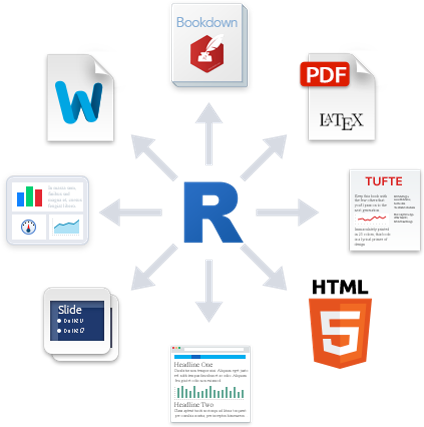
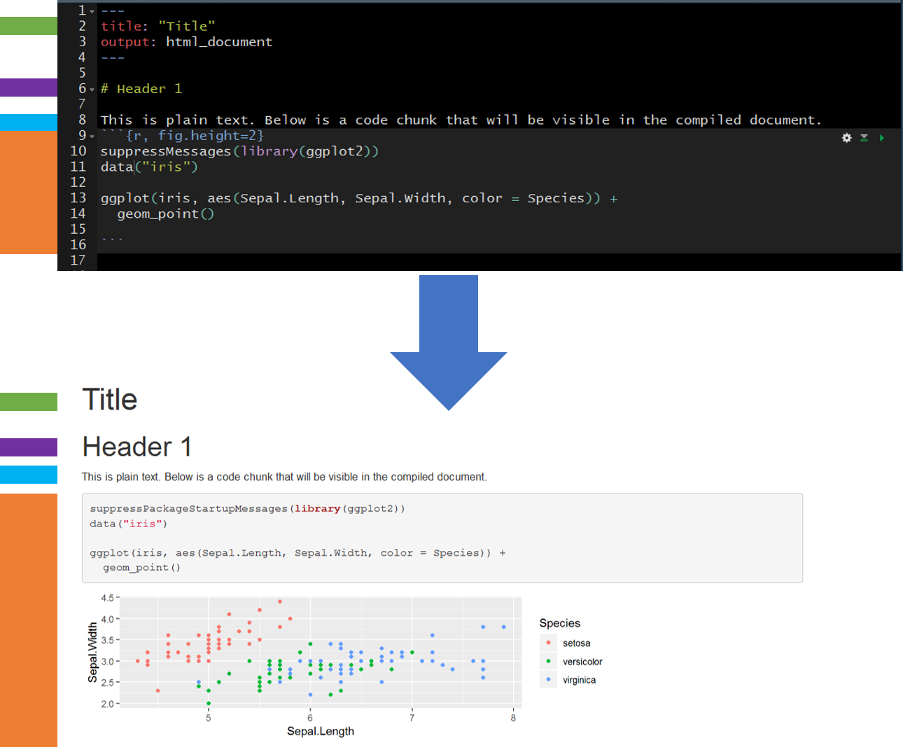

# Introduction

{width=200px} 

* __R Markdown: The Definitive Guide:__ https://bookdown.org/yihui/rmarkdown/
* __RStudio Lessons:__ https://rmarkdown.rstudio.com/lesson-1.html

Markdown is a markup language for developing and formatting documents. R Markdown is an R-package that allows the user to integrate text, R-code, and R-code output into a well formatted document (e.g., HTML, MS Word, PDF). 

My recommendation is to create an R Markdown file for every R-project. The intention is to document as much of the project as possible.  R Markdown provides a more readable document, with better descriptions of how and why an activity was performed, than a standard R script with a few commented lines. 

## Benefits

* __Reproducible:__ Document steps of an investigation or scientific study 
    + [reproducibility crisis](https://www.nature.com/news/1-500-scientists-lift-the-lid-on-reproducibility-1.19970).

{width=500}

* __Collaborative:__ Easy to work with others on investigations and scientific studies.

{width=500}

* __Efficient:__ Generate and update reports automatically (e.g., HTML, MS Word, and PDF).

{width=500}

* __Engaging:__ Embed interactive figures, maps, and tables in reports (HTML only).
    + __Source:__ https://plotly-book.cpsievert.me/images/gapminder-highlight-animation.gif

{width=500}

## Basic Overview

Use markdown syntax, some of which is shown in the table below, to format the document.

* __Source:__ https://www.rstudio.com/wp-content/uploads/2015/03/rmarkdown-reference.pdf

{width=800}

Once the document is complete (formatted with markdown syntax with integrated R code) the document can be knit (rendered) using the package __knitr__.

Here is a simple example showing the raw R Markdown (Rmd) file before knitting (rendering) and after knitting. The colors on the far left are there to help identify elements pre- and post-knitting.

{width=700}

R is not the only language supported by R Markdown. Languages supported by R Markdown include, but are not limited to,...

{width=500}

