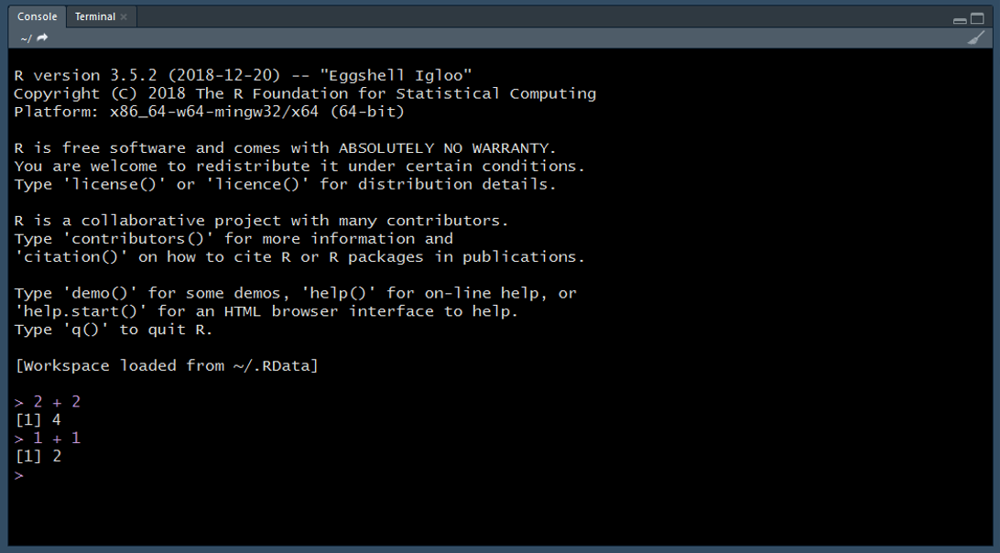
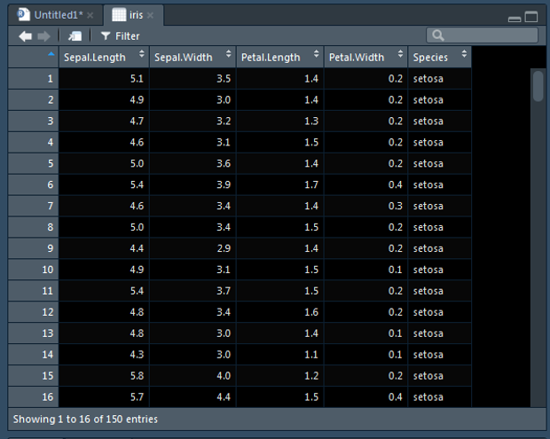
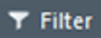
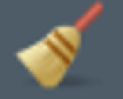
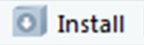

# R and R Studio

## What is R?

R is an open source programming language developed for statistical computing and graphic production. "R can be considered as a differenct implementation of S", a language that was developed at Bell Laboratories (https://www.r-project.org/about.html).

### Benefits of Using R

1. __Reproducibility:__ Standardized processes (e.g., functions, loops, documentation)
    + When using MS Excel processes are often spread across multiple sheets or calculations are performed haphazardly within a single sheet. In general, this makes it very hard to interpret processes performmed and to reproduce the process.
2. __Power:__ Ability to perform simple and complex data manipulations, iterative processes, and calculations
    + Access to more than 10,000 packages on CRAN
    + New packages are constantly being developed
    + New features are contsantly being added to existing packages

### R Packages

R packages are extensions of base R that provide additional features or provide alternative functionality.

* Availability
    + CRAN (https://cran.r-project.org/)
        + The Comprehensive R Archive Network (CRAN)
        + FTP and web servers that store R Packages
        + Packages are rwquired to meet certain standards
    + GitHub (https://github.com)
        + These packages are usually under development
        + Contains development versions of many packages available on CRAN
    + Custom (http://r-pkgs.had.co.nz/)
        + You have the ability to create your own packages.

{width=700px}

## RStudio

Open source integrated development environment (IDE) for R developed by R Studio.

* Edit scripts
* Run scripts
* Navigate files
* Organize projects
* Utilize version control (Git and Subversion)
* View static and interactive graphics
* And more...

###	Create a New Script

1. Click on the new document buttion: 


2. Click on R Script:

{width=150px}

### RStudio Overview

Once you have open an existing script or created a new script, following the instructions from the previous section, your RStudio should look similar to the following image. I have added labels to each of the windows.


#### Source Window

This window appears when you open an exisiting R script or create a new R script [Create a New Script]. You will perform most of your write, edit, save, and execute your code.

<center>

</center>

#### Console Window

Similar to the [Source Window], code can also be executed in the console but it is not as easy to edit or save code written in the console window. Generally, I only write and execute code in the console window if I am just testing new code or want to quickly view data.



#### Environment, History, Connections, Build, and Git

This window pane includes many features. Here we will only focus on the [Environment Tab] but I will briefly review the other tabs available.

* __History Tab:__ view the order in which you have executed code.
* __Connections:__ connect to databases and show your connections to those databases.
* __Build:__ will only appear if you are building a custom package becuase it is used to compile the package and add it to your library.
* __Git:__ will only appear if you connect your [R Project] to Git (see [GitHub] section).

##### Environment Tab

Objects created in the [Source Window] or the [Console Window] are stored in the global environment. The Environment tab allows you to view the objects stored in the global environment.

You can read more about environments in Hadely Wickham's Advanced R book available for free online (http://adv-r.had.co.nz/Environments.html).

In the [Source Window] example, I loaded the `iris` data frame into the global environment. This data frame will appear within Environment tab. We can see that this data frame has 150 obs. (rows) and 5 variables (columns).

<center>

</center>

If we click on the blue circle next to `iris`, we will be provided with a glimpse into the data frame. Below we can see the columns that make up the data frame, the type of data they represent, and the first view values in a given column. The first four columns, `Sepal.Length`, `Sepal.Width`, `Petal.Length`, and `Petal.Width`, are numeric (`num`) data type. The last column, `Species`, is a factor data type.

<center>

</center>

If we click on the view table button.

<center>
{width=100px}
</center>

The data frame will open in a tab within the [Source Window]. Here we can scroll through and view all of the data within the `iris` data frame. 

<center>

</center>

If we want to view a subset of data we can apply a global filter by filtering with...

<center>
{width=200px}
</center>

or we can apply column specific fileters if we click the filter button.

<center>
{width=150px}
</center>

The global environment can be cleared by using the clear button.

<center>
{width=100px}
</center>

When your global environment has been cleared the Environment Tab will look like this...

<center>

</center>

#### Files, Plots, Packages, Help, and Viewer

#### Files Tab

* Open R Scripts by clicking.
* View file structure without leaving RStudio.
    + Helpful for finding files to import or to verify a file exported.
* More beneficial if working in an R Project.

<center>

</center>

#### Plots Tab

* View plots created in script.
* You can manually export from this tab.
    + Generally recommended that you write script to do this (reproducible).
    
<center>

</center>

#### Packages Tab

* View packages installed on your computer.
* Button to update installed packages.


* Button to install new packages.



<center>

</center>

#### Help Tab

* __General Structure:__ Description, Usage, Arguments, See Also, and Examples.
* Important to review to understand how the function works.

<center>

</center>

#### Viewer Tab

* Similar to the [Plots Tab] but allows you to view interactive plots.

### Shortcuts

A list of all RStudio shortcuts can be found here: https://support.rstudio.com/hc/en-us/articles/200711853-Keyboard-Shortcuts

You can also press __Alt+Shift+K__ within RStudio to pull up a list of shortcuts.

__Below are my favorite shortcuts:__

```{r, echo=FALSE}
knitr::kable(data.frame(
  Description = c(
  "Run Current Line/Selection",
  "Insert Code Section",
  "Re-indent Lines",
  "Reformat Selection",
  "Find and Replace",
  "Undo",
  "Redo",
  "Cut",
  "Copy",
  "Paste",
  "Select All",
  "Insert Pipe Operator",
  "Insert Code Chunk",
  "Restart R Session"
  ),
  "Windows & Linux" = c(
  " Ctrl+Enter",
  "Ctrl+Shift+R",
  "Ctrl+I",
  "Ctrl+Shift+A",
  "Ctrl+F",
  "Ctrl+Z",
  "Ctrl+Shift+Z",
  "Ctrl+X",
  "Ctrl+C",
  "Ctrl+V",
  "Ctrl+A",
  "Ctrl+Shift+M",
  "Ctrl+Alt+I",
  "Ctrl+Shift+F10"
  ),
  Mac = c(
    "Command+Enter",
    "Command+Shift+R",
    "Command+I",
    "Command+Shift+A",
    "Command+F",
    "Command+Z",
    "Command+Shift+Z",
    "Command+X",
    "Command+C",
    "Command+V",
    "Command+A",
    "Command+Shift+M",
    "Command+Option+I",
    "Command+Shift+F10"
  ))
)
```