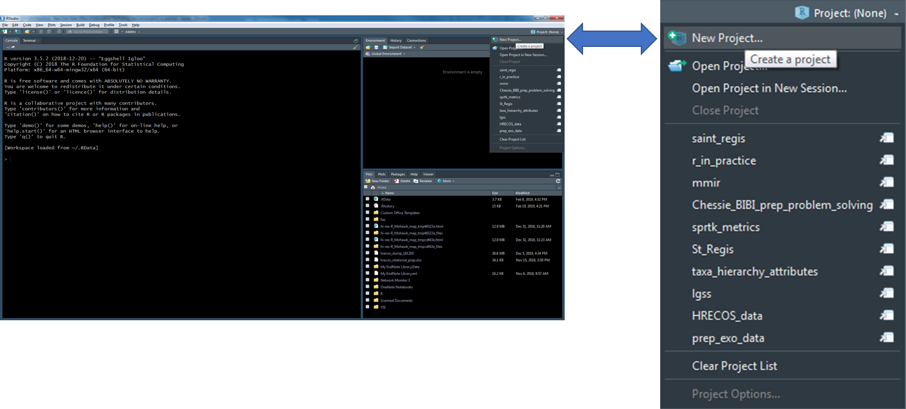
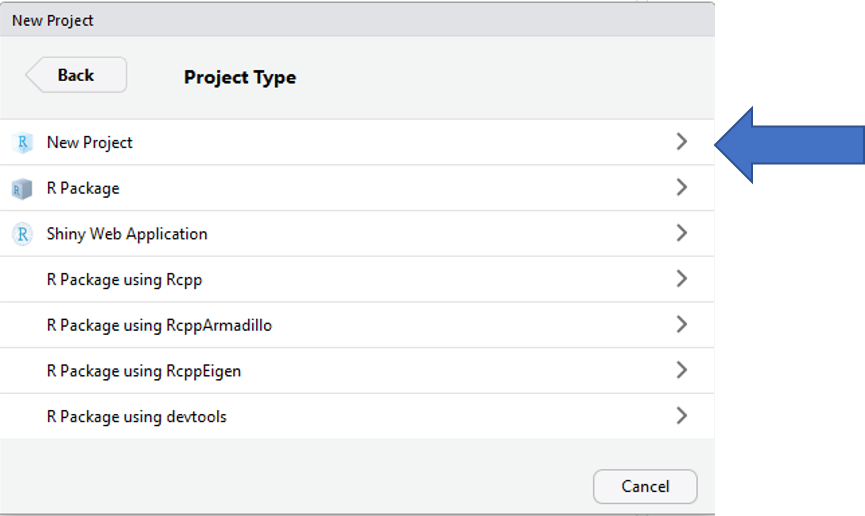

# Lesson 1: R Project Development

## Overview

* Easier to access files (relative path)
    + Relative paths help prevent broken paths
        + In general, DO NOT use setwd()
        + Will work if the project folder is moved to a new location on you local machine or moved to a new machine.
* Designed to easily integrate with version control (GIT)
* In general, all data, scripts, and output should be stored within the project directory.

## Create a New R Project

1. Create a new R project by clicking on the drop-down menu at the top right of RStudio and selecting "New Project"

{width=1000px}

2. Select "New Directory" within the "Create Project" window

{width=500px}

3. Select "New Project" within the "Project Type" window

{width=600px}

4. Enter a project name(below I have given the name "new_project"), the project directory (where the project should live), and select "Create Project"
    + __Tip: Create a “project” folder that will act as your parent directory for all R projects. This will make it much easier to navigate to and between projects.__


5. A new session specific to your R project will start within RStudio
    + There are a number of ways to tell which project is open...


## Navigate Between Projects

Quickly navigate between recently opened R projects by clicking on the drop-down menu at the top right of RStudio and selecting the project of interest.

{width=400px}


## Recommended Workflow

1. Set up a GitHub repository.
2. Create an R-project connected to the GitHub repository.
3. Develop R-scripts.
4. Push and pull project changes to and from GitHub.


## Your Turn

1. Open R Studio.
2. Create a new Project.
3. Add an "data" folder and add the example data set to this folder.
4. Create a new R Script (Ctrl + Shift + N) and save the script as "lesson_1.R" to your project root folder.
5. Add the following script and run it (Ctrl + Enter)
    + Notice that the entire file path to CSV of interest ("zms_thesis_metrics.csv") was not specified just `file.path("data", "zms_thesis_metrics.csv")`.
```{r, eval=FALSE}
thesis.df <- read.csv(file.path("data",
                                "zms_thesis_metrics.csv"),
                      stringsAsFactors = FALSE)

head(thesis.df)
```
6. View `thesis.df` in the Environment panel
    + How many rows and columns does our data frame have?
    + Click on the drop-down menu (the blue circle to the left of `thesis.df`). 
        + Can you identify the column type (e.g., Character, Numeric, Integer, or Factor) of the columns `unique_id`, `substrate_size_d50`, `richness`, and `pct_diptera`?
        + What are the first, second, and third `unique_id`'s represented in the data frame and which `richness` values are associated with each `unique_id`?
    + Click on the button to view the data (the small girdded table to the far-right of `thesis.df`)
        + Filter the data frame to only see data from Onondaga Lake (`lake` = "onon")
