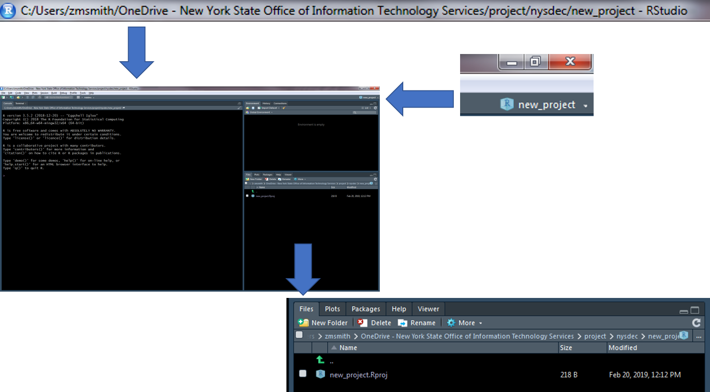

# R Project Development

__Overview__

* Easier to access files (relative path)
    + Relative paths help prevent broken paths
        + In general, DO NOT use setwd()
        + Will work if the project folder is moved to a new location on you local machine or moved to a new machine.
* Designed to easily integrate with version control (GIT)
* In general, all data, scripts, and output should be stored within the project directory.

## Create a New R Project

1. Create a new R project by clicking on the dropdown menu at the top right of RStudio and selecting "New Project"

2. Select "New Directory" within the "Create Project" window

{width=500px}

3. Select "New Project" within the "Project Type" window

{width=600px}

4. Enter a project name(below I have given the name "new_project"), the project directory (where the project should live), and select "Create Project"
    + __Tip: Create a “project” folder that will act as your parent directory for all R projects. This will make it much easier to navigate to and between projects.__

5. A new session specific to your R project will start within RStudio
    + There are a number of ways to tell which project is open...

## Navigate Between Packages

Quickly navigate between recently opened R projects by clicking on the dropdown menu at the top right of RStudio and selecting the project of interest.

{width=400px}

## Recommended Workflow

1. Set up a GitHub repository.
2. Create an R-project connected to the GitHub repository.
3. Develop R-scripts.
4. Push and pull project changes to and from GitHub.

