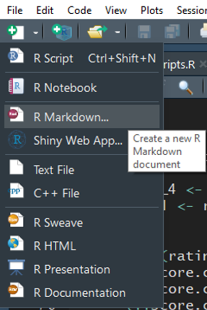
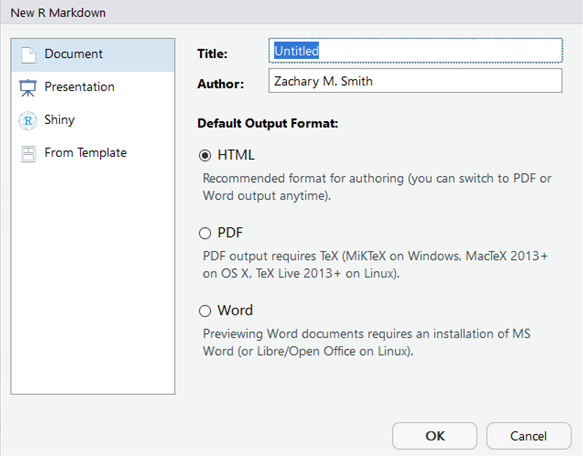
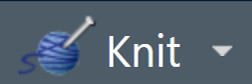
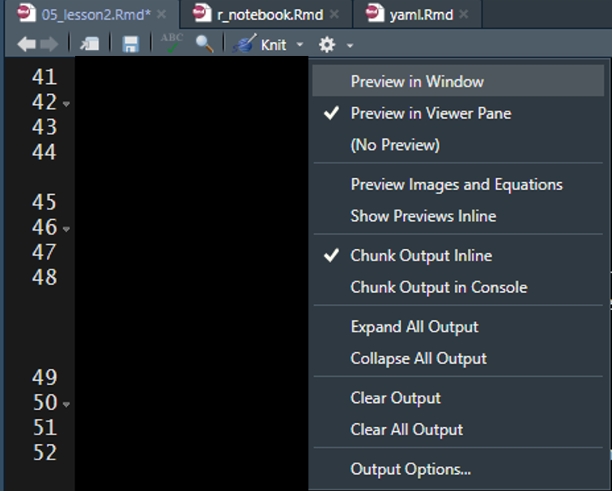
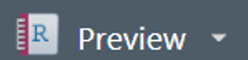
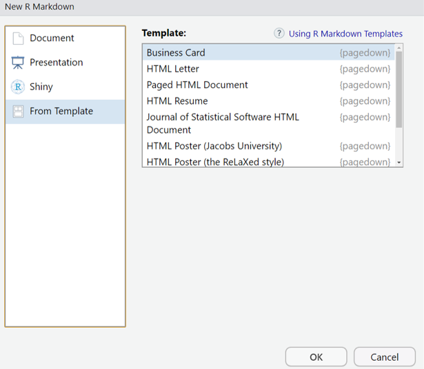

# Lesson 2: Rmd Creation

##	Create a New Document

1. Click on the new document button: 

2. Click on R Markdown:

{width=300px}

3. Provide a "Title:", select the "Default Output Format:", and click "OK"

{width=400px}

4. A new R Markdown document will appear with some instructions and example text/code.

{width=600px}

##	Compile the Document

{width=160px}

To view the html document, you must compile the document using Knit. The easiest way to knit a document is to navigate to and click on the Knit button (it looks like a ball of yarn) in the toolbar above the editor window. If a window appears saying “Install Required Packages” for R Markdown, install the necessary packages for knitting the document. The compiled file will be saved in the same directory as your Rmd file (your R Markdown file). I generally store the R Markdown file(s) in a sub-directory labeled “rmarkdown” within the R-project folder (rproject/markdown), which prevents the project directory from becoming cluttered-- this is __NOT__ necessary.

You can click on the small triangle to the right of the Knit button to view a drop-down menu of knitting options. Here you have the option to update the document type you want to knit (examples listed below).

* Knit to HTML
* Knit to PDF
* Knit to Word

By clicking one of these options your YAML header updates automatically. We will discuss YAML headers in a later section, but in short the YAML header defines some of the formatting options associated with the document, including the output type. You can have multiple document types render at once (e.g., a separate HTML and Word document are created with each knit call).  

## Document Types

There are multiple document types available which designate how the .Rmd file will be rendered (knit).

### HTML

Knittin to a HyperText Markup Language (HTML) document is the default for R Markdown. Using HTML will enable you to add interactive features to your document. To view HTML documents, simply open them in your internet browser of choice-- by default, your machine should open HTML documents in your default browser automatically.

#### R Markdown vs. R Notebook

R Markdown documents (`html_documents`) and R Notebook documents (`html_notebook`) are very similar; in fact, an R Notebook document is a special type of R Markdown document. The main diffence is using R Markdown document (`html_documents`) you have to knit (render) the entire document each time you want to preview the document, even if you have made a minor change. However, using an R Notebook document (`html_notebook`) you can view a preview of the final document without rendering the entire document. 

For all document types you can specify how you want to preview the rendered documents by clicking on the cog in the Source window toolbar to reveal a drop-down menu of options. The recommended setup for use of an R Notebook document would be to specify you want to view the preview in the Viewer pane (i.e., the bottom right pane shared with Files, Plots, Packages, and Help).

{}

Then click on the "Preview" button in the Source window toolbar to render a preview of the final document.

{}

Keep the Viewer pane open and do not close the preview of the document. Now begin to edit the markdown syntax in the document. Each time you save the document the preview window will render the changes made to the markdown syntax. If you edit R code chunks, you must run the code chunks within the notebook file prior to saving to see the changes in the Viewer window.

### PDF

You have the ability to knit to Portable Document Format (PDF) but you will not be able include interactive features in the document. Knitting to a PDF requires you to have the program LaTeX installed. You will get the following error message if you try to knit a PDF document without LaTeX installed on your machine:
> No LaTeX installation detected (LaTeX is required to create PDF output). You should install a LaTeX distribution for your platform: https://www.latex-project.org/get/
If you are not sure, you may install TinyTeX in R: tinytex::install_tinytex()
Otherwise consider MiKTeX on Windows - http://miktex.org
MacTeX on macOS - https://tug.org/mactex/
(NOTE: Download with Safari rather than Chrome _strongly_ recommended)
Linux: Use system package manager

### Word

You have the ability to knit to Microsoft Word if you have Microsoft Word installed on your machine. Similarly to PDFs, you will not be able to include interactive features in your Word documents.

### Templates

#### Provide Templates

There are a number of templates you can install or will come with packages you install, which you can view in the pop-up window that appears when you select that you want to create a new R Markdown file.

{}

These templates may give you a jump-start to provide a large portion of the formatting specification to make specific documents. Some example templates from the package __pagedown__ are:

* Business Card
* Letter
* Paged HTML Documents
* Resume
* Journal Article
* Poster
* Thesis
* Package Vignette

#### Custom Templates

You also have the ability to specify custom templates in your YAML header. We will discuss YAML headers in a later section. 

I have only used this feature for Microsoft Word documents. I created a new document within Microsoft Word and selected all of the formatting options I wanted for my document. I then added the template to the YAML header of my R Markdown document to specify that when the document is knit (rendered) to apply the formatting specifications found in the template Microsoft Word document.

### Other Types

#### Presentations

You have the ability to create presentation slides using R Markdown. Below are the different format options available. Exampes can be found in the following link under the "Presentation" section: https://rmarkdown.rstudio.com/gallery.html

* ioslides (HTML)
* Slidy (HTML)
* Beamer (PDF)
    + Requires LaTeX
* Microsoft PowerPoint
    + Requires Microsoft PowerPoint
    
I have tried to create presentations with R Markdown on several occasions but I always revert back to using Microsoft PowerPoint. I have not found these slides to be very flexible and seem to only be able to generate simple slides without much content. My recommendation would be to try these slides out if you are making a presentation demonstrating how to use simple R code.

#### Shiny Documents

Shiny documents enable you to embed a shiny application into an R Markdown document. This will enable you to insert custom interactive features into your document. The final document will need to be an HTML file.

## Your Turn

1. Create a new HTML Rmd file.
2. Save the document to your project root folder.
3. Knit the default document produced by RStudio.
4. Using the Knit drop-down menu, specify that you want to create a Word document.
   + This will only be possible if you have Microsoft Word installed on your machine.
5. __Bonus:__ Try creating new R Markdown documents and selecting Presentation, Shiny, and other templates available. Each selection will provide you with an example .Rmd file that you can knit (render) and explore.

