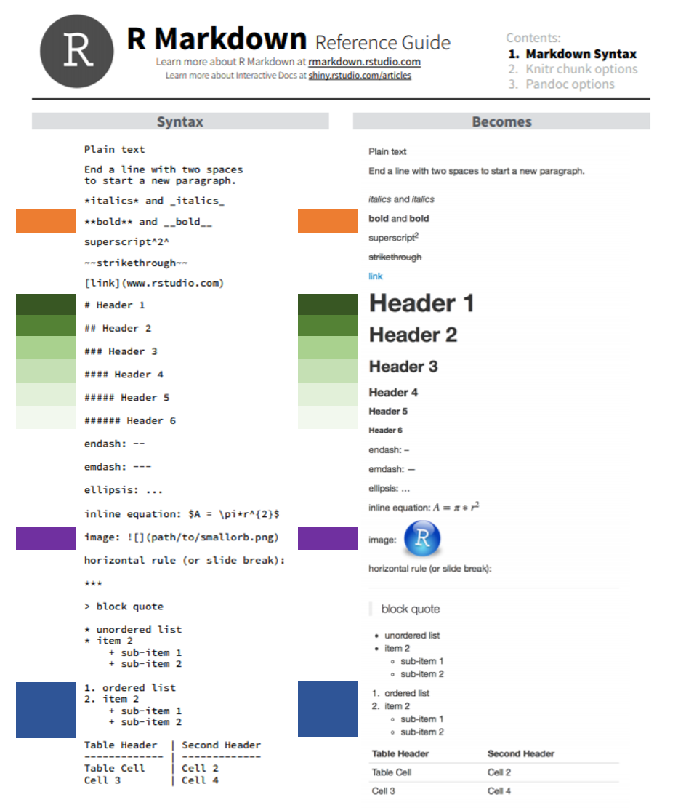

# Lesson 3: Basic Syntax

* __Source:__ https://www.rstudio.com/wp-content/uploads/2015/03/rmarkdown-reference.pdf

{width=800}

## Non-Code Related Syntax

###	Heading Text

Heading text follows one or more hash-sign(s) (#). The number of hash-signs determines the hierarchy of headings. For example, “# Heading 1” would represent the primary heading, “## Heading 2” would represent the secondary heading, “###Heading 3” would represent the tertiary heading, and so forth.

###	Plain Text

Simply add text below the YAML header. To start a new paragraph, you will need to end your plain text line with two (2) spaces.

### __Bold__ and _Italized_ Text

There are two ways to format your text to be __bold__ or _italized_.

* __Bold__
  + Surround your text with two (2) asterisks (*) on each side.
  + Surround your text with two (2) underscores (_) on each side.
* _Italized_
  + Surround your text with one (1) asterisk (*) on each side.
  + Surround your text with one (1) underscore (_) on each side.
  
### Lists

#### Unordered Lists

Unordered or bulleted lists can be generated by using a single astrisk (*) followed by a space and the plain text intended to represent the bullet. To add another bullet, just hit enter or return and follow the previous steps. To add sub-bullets, insert two spaces and a plus sign (+) followed by a space and the plain text intended to represent the sub-bullet. You can do this at multiple levels; meaning you can add four spaces and a plus sign (+) to insert a sub-sub-bullet and six spaces and a plus sign (+) to add a sub-sub-sub-bullet.

* Bullet 1
* Bullet 2
  + Sub-Bullet 1
  + Sub-Bullet 2
    + Sub-Sub-Bullet 1
      + Sub-Sub-Bullet 1

#### Ordered Lists

Follow the steps in Unordered Lists but instead of using astricks (*) use sequential numbers followed by a period (.)-- this cannot be done for sub-bullets. For example, "1.", "2.", and "3.". 

1. Bullet 1
  + Sub-Bullet 1
2. Bullet 2
  +. Sub-Bullet 1
  + Sub-Bullet 2
    + Sub-Sub-Bullet 1

    
### Your Turn

1. Delete everything below the YAML header.
2. Add the following level-1 headers and knit the document.
  + Introduction
  + Workflow
  + Import Data
  + Preprocessing
  + Study Area
  + Plot
  + Conclusions
3. Add two level-2 headers below the Plot header and knit the document.
  + Scatter Plot
  + LOESS Plot
3. Add plain text below the Introduction header and knit the document.
  + Be sure to include some __bold__ and _italicized_ text.
  + Explain the purpose of the document (e.g., "This document was created during the 2020 NABs R Markdown workshop and will serve as an example workflow for my future use of R Markdown.")
4. Add unordered or ordered list below the Workflow header and knit the document.
  + Describe the workflow we have talked about thus far (e.g., create an R project, add folders, create an rmarkdown document, knit the document to render).
  + Add sub-bullets with helpful details.

