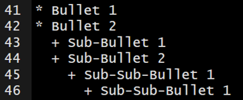
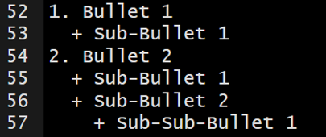
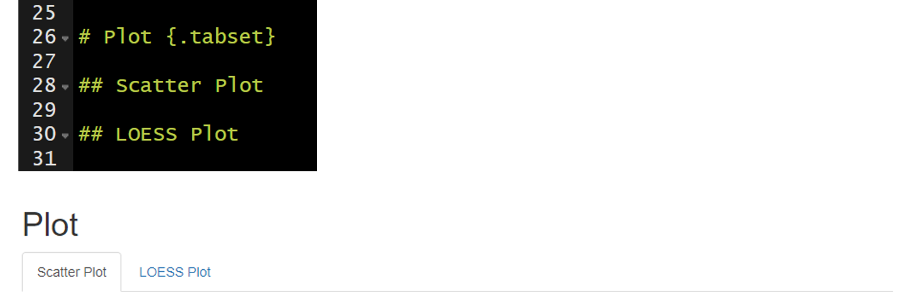

# Lesson 3: Basic Syntax

* __Source:__ https://www.rstudio.com/wp-content/uploads/2015/03/rmarkdown-reference.pdf

{width=800}

##	Heading Text

Heading text follows one or more hash-sign(s) (#). The number of hash-signs determines the hierarchy of headings. For example, “# Heading 1” would represent the primary heading, “## Heading 2” would represent the secondary heading, “###Heading 3” would represent the tertiary heading, and so forth.

##	Plain Text

Simply add text below the YAML header. To start a new paragraph, you will need to end your plain text line with two (2) spaces.

## __Bold__ and _Italicized_ Text

There are two ways to format your text to be __bold__ or _italicized_.

* __Bold__
  + Surround your text with two (2) asterisks (*) on each side.
  + Surround your text with two (2) underscores (_) on each side.
* _Italicized_
  + Surround your text with one (1) asterisk (*) on each side.
  + Surround your text with one (1) underscore (_) on each side.
  
The markdown syntax...

{}

which renders to...

**Bold Text Example**

__Bold Text Example__

*Italicize Text Example*

_Italicize Text Example_
  
## Lists

### Unordered Lists

Unordered or bulleted lists can be generated by using a single asterisk (*) followed by a space and the plain text intended to represent the bullet. To add another bullet, just hit enter or return and follow the previous steps. To add sub-bullets, insert two spaces and a plus sign (+) followed by a space and the plain text intended to represent the sub-bullet. You can do this at multiple levels; meaning you can add four spaces and a plus sign (+) to insert a sub-sub-bullet and six spaces and a plus sign (+) to add a sub-sub-sub-bullet.

The markdown syntax...

{}

which renders to...

* Bullet 1
* Bullet 2
  + Sub-Bullet 1
  + Sub-Bullet 2
    + Sub-Sub-Bullet 1
      + Sub-Sub-Bullet 1

### Ordered Lists

Follow the steps in Unordered Lists but instead of using asterisk (*) use sequential numbers followed by a period (.)-- this cannot be done for sub-bullets. For example, "1.", "2.", and "3.". 

The markdown syntax...

{}

which renders to...

1. Bullet 1
  + Sub-Bullet 1
2. Bullet 2
  + Sub-Bullet 1
  + Sub-Bullet 2
    + Sub-Sub-Bullet 1

## Link to a Section

You can link to a section within the document by surronding the name of the section in square brackets. 

The markdown sytnax...

`[Lesson 3: Basic Syntax]`

would render to this...

[Lesson 3: Basic Syntax]

If you click on the "Lesson 3: Basic Syntax" above, it will jump you to the head of this section.

## Hyperlink

You simply need to paste in a full URL into your document and it will automatically be recognized as a hyperlink. If you want to hide the full link and represent it with text, then surrond the text with square brackets followed by the URL in parenthesis. 

The markdown syntax...

`[link](https://bookdown.org/yihui/rmarkdown/)`

would render to this...

[link](https://bookdown.org/yihui/rmarkdown/).

## Insert Images

You can insert images into your document using syntax similar to the hyperlink syntax above. 

In the code below you can see the file path the to the image. This image will render without a caption

``

You can add a caption for the image in between the square brackets.

``

You can control the size of the image like this...

`{width=200px}`

{width=100px}

You can center the image like this...

{width=100px}

## Tabbed Sections

Tabbed sections can be added to section of an HTML documents that will fold all of the subsequent sub-sections into seperate tabs. To do this you specify a section header followed by `{.tabset}`. For example, `## My Section Header {.tabset}`.

{}

Note this feature is not available for use with __bookdown__.

## Your Turn

1. Delete everything below the YAML header.
2. Add the following level-1 headers and knit the document.
    + Introduction
    + Workflow
    + Import Data
    + Preprocessing
    + Study Area
    + Plot
    + Conclusions
3. Add two level-2 headers below the Plot header and knit the document.
    + Scatter Plot
    + LOESS Plot
3. Add plain text below the Introduction header and knit the document.
    + Be sure to include some __bold__ and _italicized_ text.
    + Explain the purpose of the document (e.g., "This document was created during the 2020 NABs R Markdown workshop and will serve as an example workflow for my future use of R Markdown.")
    + Include the hyperlink to R Markdown: The Definitive Guide (https://bookdown.org/yihui/rmarkdown/). This will be a helpful resource in the future.
4. Add unordered or ordered list below the Workflow header and knit the document.
    + Describe the workflow we have talked about thus far (e.g., create an R project, add folders, create an rmarkdown document, knit the document to render).
    + Add sub-bullets with helpful details.
5. Add the image provided with the data to the introduction.
6. Make the Plot section tabbed section with `{.tabset}`.

