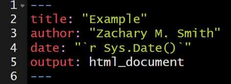
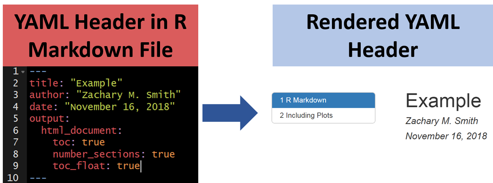
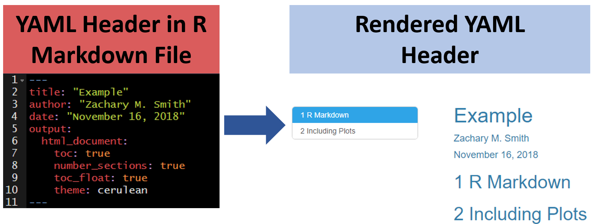
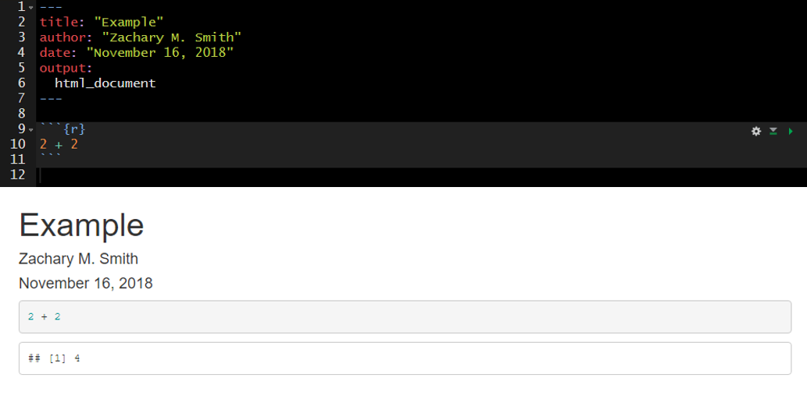
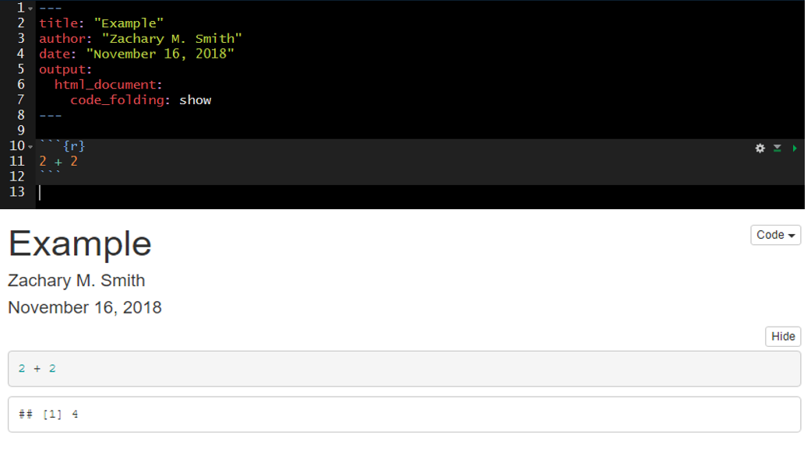
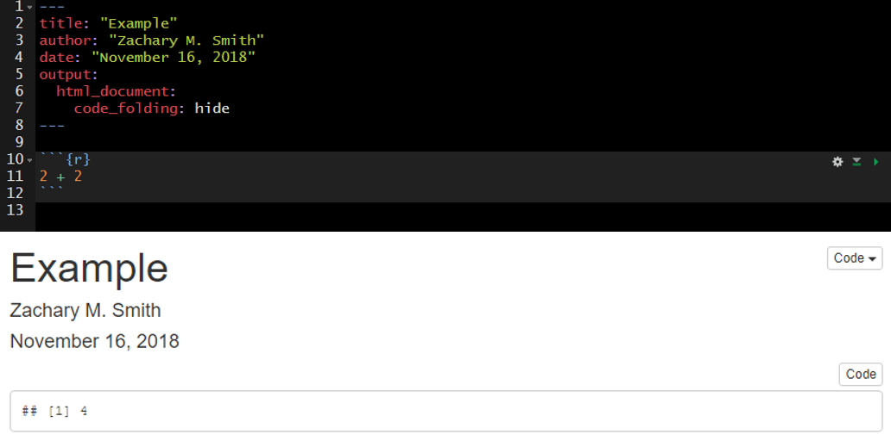
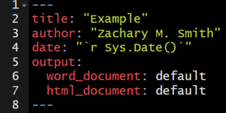
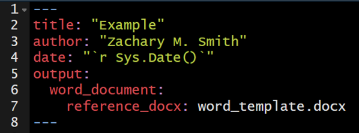
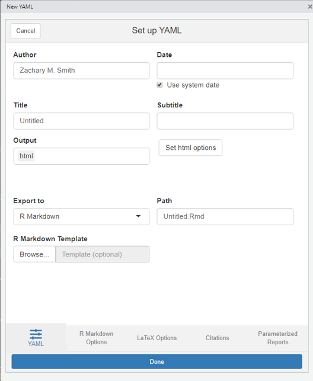

# Lesson 4: YAML Headers

__YAML:__ YAML Ain’t Markup Language

A YAML header contains YAML arguments, such as "title", "author", and "output", demarcated by three dashes (---) on either end.

## Title

The specified title (`title: "My Title"`) will appear at the head of the document with a larger font size than the rest of the document.

### Subtitle

You can specify subtitle (`subtitle: "My Subtitle"`), which will appear below and in slightly smaller font size than the title of the document.

## Author(s)

An author can be specified (`author: "Zachary M. Smith"`) and will appear at the head of the document but below the title(s). You can specify multiple authors by separating the names of the authors by a comma (`author: "Zachary M. Smith, John Doe"`).

## Date

You can supply a date (`date: "March 3rd, 2020"`) that will be added to the head of the document. You can specify a static date (`date: "March 3rd, 2020"`) or a dynamic date (see image below) that will update each time you knit (render) the document-- we will discuss this further in a subsequent section.

## Table of Contents (TOC)

### Floating Table of Contents (TOC)

## Themes

You can modify the YAML to specify the .theme of the document, which will change document styling (e.g., font type, color, size)

The following link provides examples of some of the available R Markdown themes: https://www.datadreaming.org/post/r-markdown-theme-gallery/

## Code Folding

Code folding refers to the HTML YAML option to hide code chunks by default, but enable the reader to click a button to show the underlying code chunk.

### Example without Code Folding

### Examples with Code Folding

#### Show

#### Hide

## output

The output option allows you to specify the type of document you want to create. This will be auto-populated if you generate the .Rmd file in RStudio by creating a new R Markdown file through the toolbar. You can manually modify the output type, but you must specify valid arguments.

Some valid arguments include:

* `html_document`
* `html_notebook`
* `pdf_document`
* `word_document`

You can click on the small triangle to the right of the Knit button to view a drop-down menu of knitting options. Here you have the option to update the document type you want to knit (examples listed below).

* Knit to HTML
* Knit to PDF
* Knit to Word

By clicking one of these options, your YAML header updates automatically. You can have multiple document types render at once (e.g., a separate HTML and Word document are created with each knit call).  

## Custom Template

You have the ability to specify custom templates in your YAML header. 

I have only used this feature for Microsoft Word documents. I created a new document within Microsoft Word and selected all of the formatting options I wanted for my document. I then added the template to the YAML header of my R Markdown document to specify that when the document is knit (rendered) to apply the formatting specifications found in the template Microsoft Word document.

## ymlthis

__ymlthis__ is an R package intended to make it easier for you to generate YAML headers. The package also includes an interactive addin that provides an intuitive user-interface for generating YAML headers. You can visit the following link to learn more about how to use ymlthis: []https://ymlthis.r-lib.org/

Addins can be accessed by navigating to "Tools" in the RStudio banner, scrolling down to "Addins", and selecting "Browse Addins." A pop-up window will appear. If you have __ymlthis__ installed on your machine, you will see the __ymlthis__ addin in the pop-up window table. Once you select the __ymlthis__ addin, you will see a pop-up window like this...

## Your Turn

1. Edit the YAML title and author and knit the document.
2. Specify in the YAML that you want to include a table of contents and knit the document.
3. Specify in the YAML that you want a floating table of contents and knit the document.
4. Specify in the YAML that you want to change the theme to "journal" and knit the document.
5. If you have Microsoft Word installed on your computer, change the YAML output to `word_document` and the knit the document.

6. __Bonus:__ If you finish early, install __ymlthis__ (`install.packages("ymlthis")`), navigate to the __ymlthis__ addin, and try to re-create the YAML header from steps 1-4.