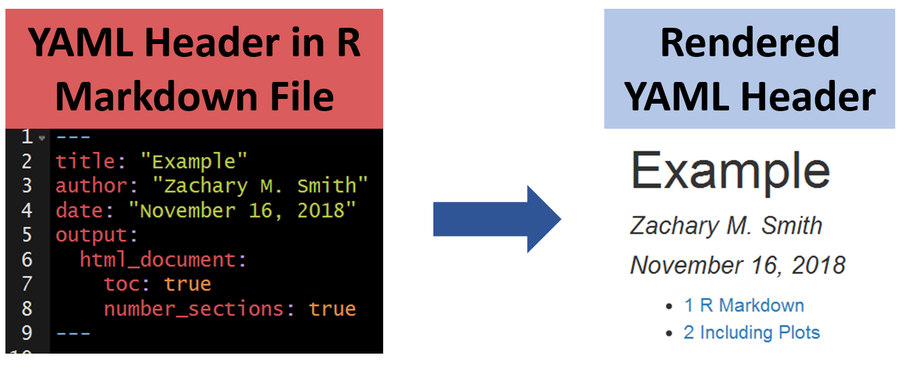

# Lesson 4: YAML Headers

__YAML:__ YAML Ain’t Markup Language

## Standard

## Table of Contents (TOC)

### Floating Table of Contents (TOC)

## Themes

You can modify the YAML to specify the .theme of the document, which will change document styling (e.g., font type, color, size)

The following link provides examples of some of the available R Markdown themes: https://www.datadreaming.org/post/r-markdown-theme-gallery/

## Code Folding

Code folding refers to the HTML YAML option to hide code chunks by default, but enable the reader to click a button to show the underlying code chunk.

### Example without Code Folding

### Examples with Code Folding

#### Show

#### Hide

## ymlthis

__ymlthis__ is an R package intended to make it easier for you to generate YAML headers. The package also includes an interactive addin that provides an intuitive user-interface for generating YAML headers.

You can visit the following link to learn more about how to use ymlthis: []https://ymlthis.r-lib.org/

## Your Turn

1. Edit the YAML title and author and knit the document.
2. Specify in the YAML that you want to include a table of contents and knit the document.
3. Specify in the YAML that you want a floating table of contents and knit the document.
4. Specify in the YAML that you want to change the theme to "journal" and knit the document.

__Bonus:__ If you finish early, install __ymlthis__ (`install.packages("ymlthis")`), navigate to the __ymlthis__ addin, and try to re-create the YAML header from steps 1-4.