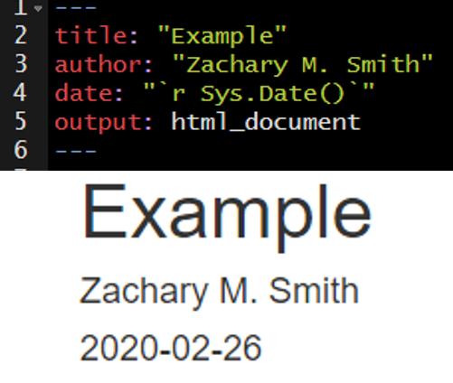

# Lesson 4: Code Chunks and Inline Code

Up to this point in the workshop we have mostly just written a standard markdown document. However, we want to integrate R code into our document to create reproducible objects, such as figures, tables, and text. This integration will make will make it easier to reproduce the document.

## Code Chunks

To insert a code chunk, press __Ctrl + Alt + i__ in the source pane (top left pane in the default settings of Studio). A code chunk will appear: 

Inside the code chunk you can write and run R-code. If you print the output of your R-code it will appear below the code chunk in the source pane and the printed output will appear in the final compiled document. This is useful for producing figures and tables.


* On the far right of the code chunk you will see three buttons. 
    + The cog makes it easy to specify code chunk options-- discused below.
    + The middle button will exectute all code chunks prior to a given function (`Ctrl + Alt + P`)
    + The far right button will execute all of the code in a code chunk.
    


### Shortcuts

__You will want to learn these ASAP.__

* `Ctrl + Alt + I` - Insert a new code chunk
* `Ctrl + Enter` - Run the line of code your cursor is on
* `Ctrl + Alt + R` - Run all of the code in the document
* `Ctrl + Alt + P` - Run all code chunks above your cursor
* `Ctrl + Shift + F10` - Restart R

### Options

There are a number of code chunk options that can be specified in the code chunk header to modify how the code chunk is rendered while kniting. These options will not be visible in the rendered document-- even if you choose not to hide the code chunks in your rendered document.

A comprehensive list of chunk options can be found here: https://yihui.org/knitr/options/

#### name

Best practice is to include a short and unique name within each code chunk header. This will be especially beneficial if you need to troubleshoot an error in your document as you will be able to track the source of the error down by code chunk name. The "name" is not specified as an argument within the header; it is simply separated from the "r" by a space. This is exemplified in the image below on line 9 where "addition" is supplied as the name of the code chunk (`{r addition}`).


#### echo

A logical value (true or false) indicating if the code chunk should be visible in the rendered document. By default the code chunk will be visible upon knitting (`echo=true`). To hide a specific code chunk set echo to "false" (`echo=false`).

Include the code chunk in the rendered document with `echo=true`.


Exclude the code chunk in the rendered document with `echo=false`.


#### fig.width, fig.height, and fig.cap

The `fig.width` and `fig.height` options allow you to control the size of the figure generated from a given code chunk. `fig.cap` provides the ability to add a caption below the figure generated from a given code chunk.

Here is an example of the plot output form a code chunk.


Here I have specified `fig.width`, `fig.height`, and `fig.cap`. Notice that plot dimensions have changed from the previous image and a caption has been added to the bottom of the figure.


In many cases, you will want the captions to be numbered and you will want this to occur automatically. To this you will first need to install the package __bookdown__ (`install.packages("bookdown")`). Specify in the YAML header that the output should be "html_document2" from the __bookdown__ package (`output: bookdown::html_document2`). When you render the document the figures will now be automatically numbered by the order they appear in the document. To cross reference a figure by name in the text use `\@ref(fig:figure_name)`. Using the example from the figure below, you might write "In `\@ref(fig:IrisScatter)` we can see that the species setosoa tend to have shorter sepal lengths than the other two species." For more information visit https://bookdown.org/yihui/rmarkdown-cookbook/figure-number.html.


#### message and warning

Using `message=FALSE` and/or `warning=FALSE` will suppress messages and warnings preventing them from printing in the rendered document. __Warning:__ Suppress these messages/warnings at your own risk. Without these messages/warnings you may make it very difficult to track down any issues in your code. 

An example of messages that are produced with the default `message=TRUE`.


The messages above can be suppressed by setting `message=FALSE` in the code chunk header.


#### include

Code chunk headers with `include=FALSE` will be ignored when the document is rendered. This can be useful during document development. For example, you may have a code chunk producing an error that prevents you from rendering the rest of your document or you may be questioning the need to keep a given code chunk. `include=FALSE` will exclude the code from the rendered document without deleting the code entirely from the .Rmd file.

The default is `include=TRUE`. In the example below, `include` is not altered from the default and therefore all of the code chunks are present in the rendered document.


In the example below I added `include=FALSE` to the header of the second code chunk named "iris-sepal-scatter." The second code chunk is excluded from the rendered document.


#### Setting Global Options

It can be helpful to establish global options to produce a standard format throughout the document. You can set this with the __knitr__ function `opts_chunk$set()`. For instance, you may want to set a standard dimensions for figures produced by code chunks throughout your document. In the code chunk below, you can see that I set `fig.width` to 8 and `fig.height` to 4. 

```{r global-options, eval=FALSE}
knitr::opts_chunk$set(fig.width = 8, fig.height = 4)
```

The options specified in `opts_chunk$set()` become the default when rendering the document. However, you still have the ability to overwrite these options for specific code chunks. Building off of the previous example, you may find that one out of ten of your plots is not aesthetically pleasing with `fig.width = 8` and `fig.height = 4`. You could specify in the code chunk producing that plot that you want to set `fig.width = 6` and `fig.height = 6`, for example.

## Inline Code

Inline code enables you to insert R code into your document to dynamically updated portions of your text.

To insert inline code you need to encompass your R code within:
.

For example, you could write:


__Which would render to:__ The mean sepal length found in the _iris_ data set is `r mean(iris$Sepal.Length)`.

I frequently use inline code to make my YAML header date update to the date the document was last rendered.



You can reformat the date using the `format()` function, as depicted in the image below.


## Your Turn (Part 1)

_The point of this exercise is to get you familiar with code chunks and inline code, NOT to test your R knowledge; therefore, I have included the necessary code below each task._

1. Add a code chunk using __Ctrl + Alt + i__ to import the example data set.
    + `read.csv(file = file.path("data", "zms_thesis_metrics.csv"), stringsAsFactors = FALSE)`
    + Add a name to this code chunk header and all subsequent code chunk headers.
    + Add plain text description above the code chunk.
    + Add the following unordered list describing the contents of the imported data.
        + `unique_id` (character) unique sample ID
        + `lake` (character) lake code: caz = Cazenovia lake, onon = Onondaga, and ot = Otisco
        + `lat` (numeric) latitude of sampling location
        + `long` (numeric) longitude of sampling location
        + `substrate_size_d50` (numeric) median particle size from pebble count
        + `conductivity` (numeric) specific conductivity (µS/cm)
        + `richness` (numeric) taxonomic richness
        + `shannon` (numeric) Shannon-Wiener diversity index values
        + `pct_ephemeroptera` (numeric) relative abundance of Ephemeroptera taxa
        + `pct_amphipoda` (numeric) relative abundance of Amphipoda taxa
        + `pct_diptera` (numeric) relative abundance of Diptera taxa
        + `dom_1` (numeric) relative abundance of the most dominant taxon observed in each sample
2. Add a code chunk to import the __tidyverse__ packages.
    + `library(tidyverse)`
    + Add plain text description above the code chunk.
    + Add `message=FALSE` to the code chunk header to prevent the package start-up messages
3. Add a code chunk below `libary(tidyverse)` to preprocess lake name (`lake`) associated with each sample.
```{r prep-lake-example, eval=FALSE}
thesis.df <- thesis.df %>% 
  mutate(lake = case_when(
    lake %in% "caz" ~ "Cazenovia",
    lake %in% "onon" ~ "Onondaga",
    lake %in% "ot" ~ "Otisco",
    TRUE ~ "ERROR"
  ),
  lake = factor(lake, levels = c("Onondaga",
                                 "Otisco",
                                 "Cazenovia")))
```
4. Add a code chunk just below the YAML header to specify global code chunk options
    + specify `fig.width` and `fig.height`
    + in the header specify `echo=FALSE` to hide this code chunk-- your reader does not need to see this
```{r global-options-example, eval=FALSE}
knitr::opts_chunk$set()
```

7. Add a code chunk to generate a scatter plot.
    + Add a caption
```{r scatter-example, eval=FALSE}
ggplot(thesis.df, aes(substrate_size_d50, pct_diptera, color = lake)) +
  geom_point()
```
8. Add a code chunk generate a boxplot.
    + Modify the figure size
    + Add a caption
```{r boxplot-example, eval=FALSE}
ggplot(thesis.df, aes(lake, richness, fill = lake)) +
  geom_boxplot()
```
9. Add a brief interpretation of the figures into the "Conclusions" section.
        
## Interactive Features

Interactive tables and figures are a great way to make your document more interesting and can be very useful for data exploration. I will warn you that if you use these features too frequently your document will become cluttered and will likely load and run slowly.

### DT

The __DT__ package enables you and your readers to interact with tables in your document. You can filter and sort the table to view data that you are most interested in exploring or understanding.

For more information visit https://rstudio.github.io/DT/

```{r}
library(DT)

datatable(iris)
```

### Plotly

__Plotly__ makes it easy to create interactive figures. Some of the most useful features  are the ability to...

* rollover figure objects and see a pop-up information related to specific features
* Zoom-in and zoom-out
* take a picture of the figure

For more information visit: https://plot.ly/ggplot2/

I generally use __plotly__ in conjunction with __ggplot2__. The __plotly__ function, `ggplotly()`, makes it simple to convert __ggplot2__ figures to interactive __plotly__ figures.
```{r plotly_example, message=FALSE}
library(plotly)

scatter.plot <- ggplot(iris, aes(x = Petal.Width, y = Petal.Length,
                                 color = Species)) +
  geom_point()

ggplotly(scatter.plot)
```

### Leaflet

__Leaflet__ is a great resource for creating interactive maps with minimal amount of coding.

For more information visit: https://rstudio.github.io/leaflet/

```{r}
library(leaflet)

data("quakes")

leaflet(data = quakes,
        options = leafletOptions(minZoom = 4,
                                 maxZoom = 18)) %>% 
  addTiles() %>% 
  addCircleMarkers(~long, ~lat,
                   fillOpacity = 0.75,
                   stroke = FALSE,
             popup = paste("Sample ID:", quakes$unique_id, "<br/>",
                           "Magnitude:", quakes$mag, "<br/>",
                           "Latitude:", quakes$lat, "<br/>",
                           "Longitude:", quakes$long)
             )
```

Another neat feature is the ability to cluster points to better vizualize density. You can do this by setting `clusterOptions = markerClusterOptions()`.
```{r}
library(leaflet)

data("quakes")

leaflet(data = quakes,
        options = leafletOptions(minZoom = 4,
                                 maxZoom = 18)) %>% 
  addTiles() %>% 
  addCircleMarkers(~long, ~lat,
                   fillOpacity = 0.75,
                   stroke = FALSE,
             popup = paste("Sample ID:", quakes$unique_id, "<br/>",
                           "Magnitude:", quakes$mag, "<br/>",
                           "Latitude:", quakes$lat, "<br/>",
                           "Longitude:", quakes$long),
             clusterOptions = markerClusterOptions()
             )
```

## Your Turn (Part 2)

1. Add a code chunk below the "Preproccessing" header and add the following __DT__ code
    + add this link (https://rstudio.github.io/DT/) to your description above the code chunk to describe where you can find more information on __DT__
```{r dt-example, eval=FALSE}
library(DT)

datatable(thesis.df, options = list(scrollX = TRUE))
```

2. Add a code chunk below the "Study Area" header and add the following __leaflet__ code
    + add this link (https://rstudio.github.io/leaflet/) to your description above the code chunk to describe where you can find more information on __leaflet__
```{r leaflet-example, eval=FALSE}
library(leaflet)

pal <- colorFactor(c("#619Cff", "#F8766D", "#00BA38"),
                   domain = c("Cazenovia", "Onondaga", "Otisco"))

leaflet(data = thesis.df,
        options = leafletOptions(minZoom = 7,
                                 maxZoom = 13)) %>% 
  addTiles() %>% 
  addCircleMarkers(~long, ~lat,
                   fillOpacity = 0.75,
                   fillColor = ~pal(lake),
                   stroke = FALSE,
             popup = paste("Sample ID:", thesis.df$unique_id, "<br/>",
                           "Lake:", thesis.df$lake, "<br/>",
                           "Latitude:", thesis.df$lat, "<br/>",
                           "Longitude:", thesis.df$long)
             )
```

3. Edit the scatter plot code chunk to make the figure interactive with __plotly__
    + add this link (https://plot.ly/ggplot2/) to your description above the code chunk
    + play around with the interactive plot and the tools provided at the top right of the plot
        + For example, you can zoom in, click on points to get more information, take a snapshot of the current plot, etc.
```{r scatter-sub-dip_example, message=FALSE, eval=FALSE}
library(plotly)

scatter.plot <- ggplot(thesis.df, aes(substrate_size_d50, pct_diptera)) +
  geom_point(aes(color = lake)) +
  geom_smooth(method = "lm")

ggplotly(scatter.plot)
```
        