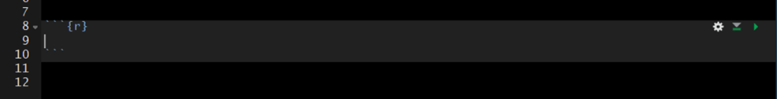

# Lesson 4: Code Chunks and Inline Code

## Code Chunks

To insert a code chunk, press __Ctrl + Alt + i__ in the source pane (top left pane in the default settings of Studio). A code chunk will appear:

Inside the code chunk you can write and run R-code. If you print the output of your R-code it will appear below the code chunk in the source pane and the printed output will appear in the final compiled document. This is useful for producing figures and tables.

### Options

There are a number of code chunk options that can be specified in the code chunk header to modify how the code chunk is rendered while kniting.

A comprehensive list of chunk options can be found here: https://yihui.org/knitr/options/

#### name

#### echo

A logical value (true or false) indicating if the code chunk should be visible in the rendered document. By defualt the code chunk will be visible upon knitting (`echo=true`). To hide a specific code chunk set echo to "false" (`echo=false`).

#### fig.width, fig.height, and fig.cap

#### message and warning

#### include
