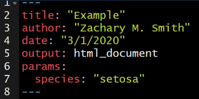
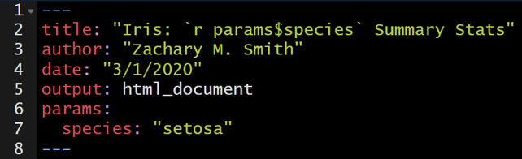
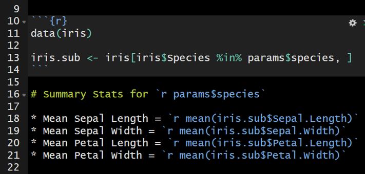
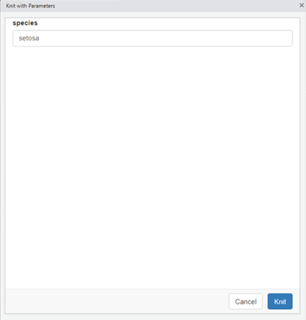
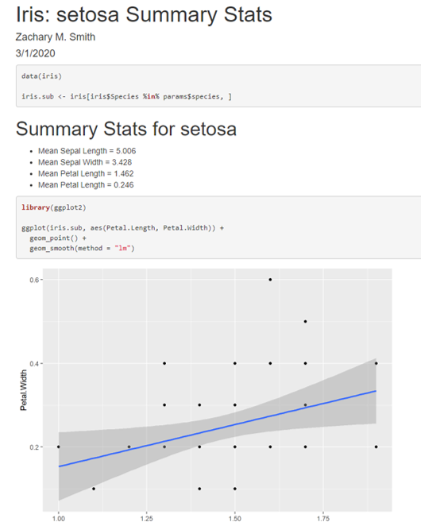

# Lesson 7: Parameterized Reports

Parameterized reports enable you to create a report template and generate reports for a subset of the data based on this template.

For example, imagine you are tasked with generating 100 one page fact sheets for lakes in your state. The fact sheets will include boilerplate language but for each lake's fact sheet you will need to update the name of the lake used through out the document, provide a list of metrics relevant to the lake (e.g., lake area, lat/longs, and max depth), and map of the lake. Think about how long it would take you to compile of the necessary components (e.g., lake metrics and lake maps), the amount of time it would take you to manually add these components to each fact sheet, and the struggles you would likely run into with formatting. Now imagine you complete all 100 fact sheets, hand the fact sheets to your boss, and they ask you to change the format of all the maps in the fact sheets. You would likely need to manually re-generate all of the maps and manually replace the maps in each document.

Here is a link to a great lecture on creating parameterized reports: https://www.coursera.org/lecture/reproducible-templates-analysis/adding-parameters-in-a-document-template-6fQwc

## params

To add a parameter or parameters to your document, add the `params:` argument below `output: html_document`. Below `params:` you can specify any parameter name you want to use and any default value you want to supply. In this example I will be using the `iris` dataset, and therefore I specified that the name of my parameter would be "species" and the default value would be "setosa."

<center>

</center>

The specified parameter can be used throughout the document with the syntax `params$species`. `params$species` will act as a place holder throughout the document until the document is rendered and, in this case, the species is specified; this specified species will be used throughout the document where `params$species` was acting as a placeholder.

In the example below, I use inline code to insert the species name into the title of the document. Therefore, the title will automatically update during rendering depending on the specified parameter.


<center>

</center>

The parmeters can also be used to filter the original data frame to a subset of interst. For example, the iris dataframe can be filtered to only include the specified species of interest using the code below.
```{r, eval=FALSE}
data(iris)

iris.sub <- iris[iris$Species %in% params$species, ]
```

The parameter can be referenced frequently to update the text in the document or to filter to the data of interest. In the image below, the iris data set will be filtered by the specified parameter to generate `iris.sub`. `iris.sub` will be used to calculate the mean value for each flower characteristic.

<center>

</center>

## Knitting

To the knit the document, click on the knit drop-down menu (the small triangle to the right of the Knit button) and select "Knit with Parmeters..." A pop-up window will appear specifying the list of available parameters and their default values. These default values can be edited prior to clicking "knit" at the bottom right of the window.

<center>

</center>

The document will then render.

<center>

</center>

## rmarkdown::render()

The __rmarkdown__ function `render()` can also be used to compile the document. The `input` specifies the parameterized .Rmd file. The `params` arguement species the parameter values to be used when rendering the document. Note that the value supplied to `params` must be wrapped by `list()`. 
```{r, eval=FALSE}
rmarkdown::render(input = "parameterized/param_template.Rmd",
                  params = list(species = "setosa"))
```

It would not be effecient to specify each parameter of interest one-by-one. Instead a loop can be written to iteratively generate parameterized documents. Below the function `lapply()` is used to create the loop. `unique(iris$Species)` supplies a vector of unique species names (i.e., "setosa", "versicolor", and "virginica") to generate parmeterized reports. `species.i` is specified as a placeholder to represent each unique species in the iris dataset; therefore `species.i` is used to specify what the species parameter should equal and it is used to generate a unique and easy to interprete file name `output_file = paste0(species.i, ".HTML")`.
```{r, eval=FALSE}
lapply(unique(iris$Species), function(species.i) {
  rmarkdown::render("parameterized/param_template.Rmd",
                    params = list(species = species.i),
                    output_file = paste0(species.i, ".HTML"))
})
```

